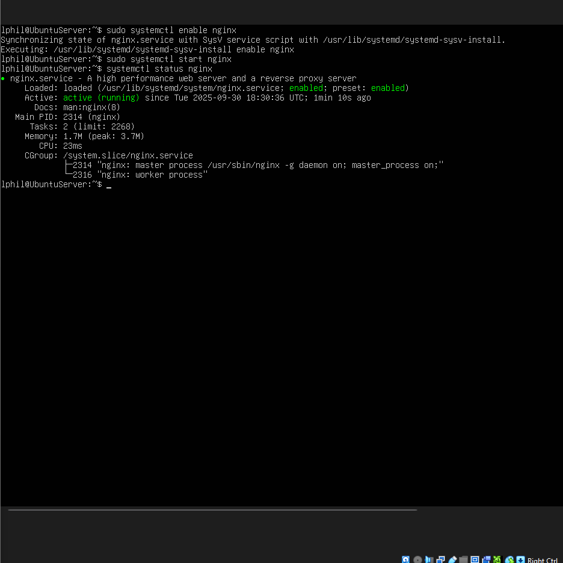
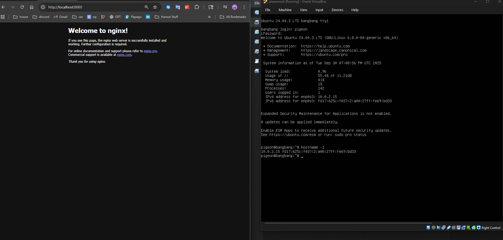
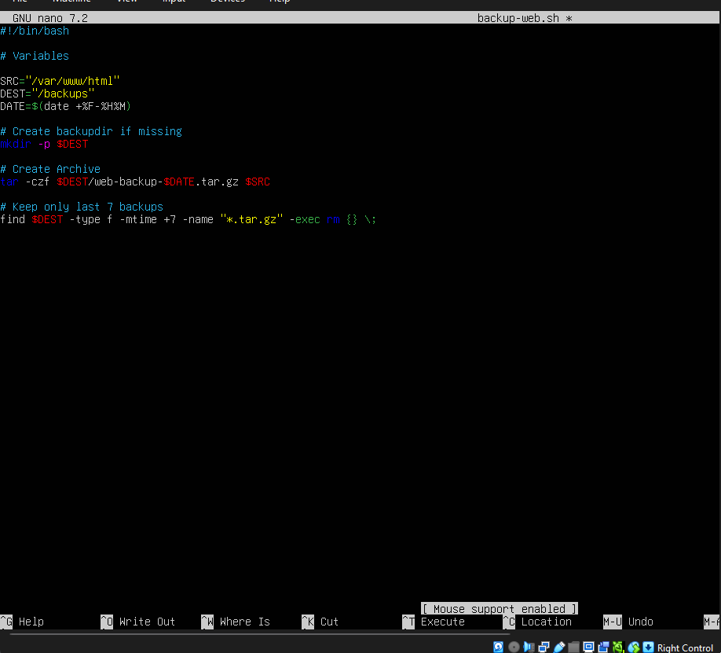
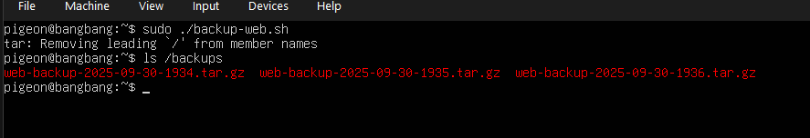
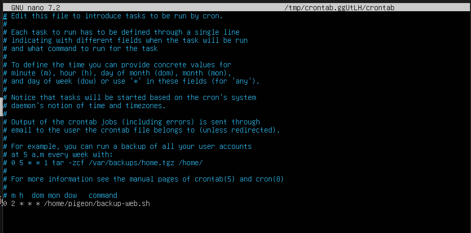
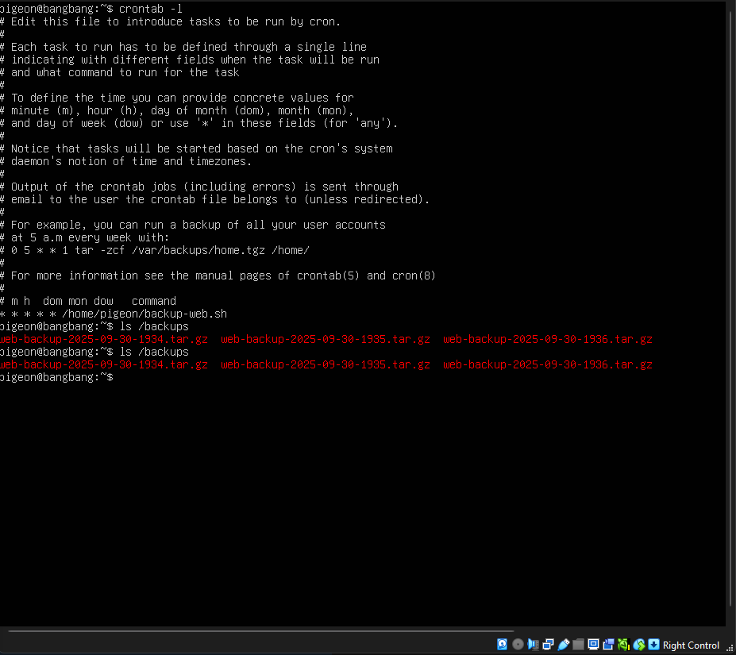
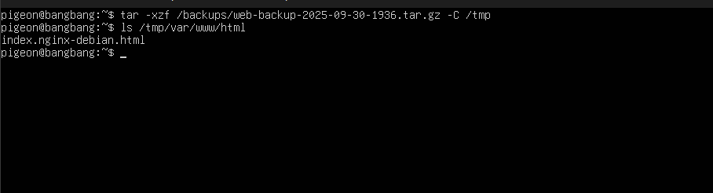
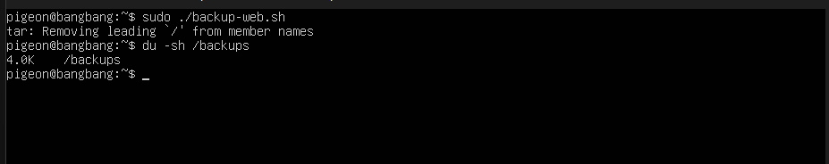
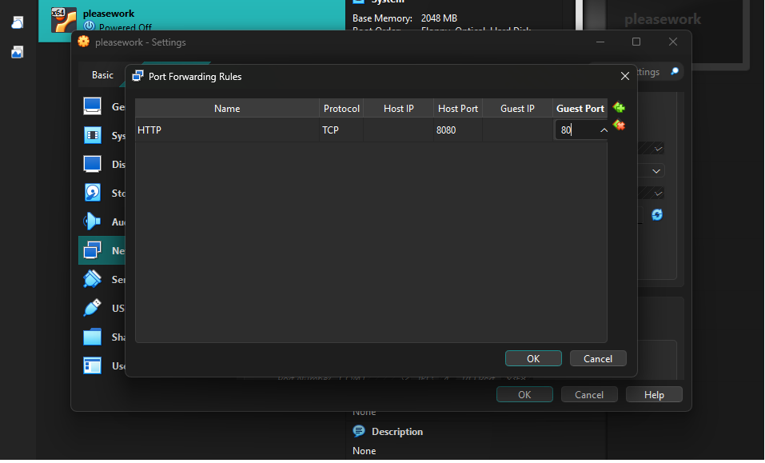

# Linux Web Server + Automated Backups Lab

A home lab project exploring the basics of deploying an Nginx web server on Ubuntu Server and configuring automated nightly backups with Bash scripts and cron jobs.

---

## Web Server (Ubuntu Server)
- **OS:** Ubuntu Server 24.04 LTS  
- **Service:** Nginx Web Server  
- **Backup Target:** `/backups` directory  
- **Automation:** cron jobs  

### Screenshots
#### Nginx Service Status

#### Browser – Nginx Default Page

#### Backup Script Creation

#### Running Backup Script

#### Crontab Configuration

#### Cron Logs

#### Backup Restore Test

#### Test Removal Script (Cleanup)

#### Port Forwarding

---

## Features Demonstrated
- Installation and verification of Nginx web server  
- Hosting and serving a webpage from Ubuntu Server  
- Creation of Bash script for automated backups  
- Scheduling with cron jobs  
- Backup restoration test into `/tmp`  
- Cleanup routine using `find` to remove older backups  
- VirtualBox port forwarding to access the server from host  

---

## How to Reproduce
1. Install Ubuntu Server in VirtualBox with NAT + Port Forwarding or Bridged Networking.  
2. Install and configure Nginx to serve a test webpage.  
3. Create a Bash script to archive `/var/www/html` into `/backups`.  
4. Schedule the script with cron (`0 2 * * *`).  
5. Verify backups are created automatically in `/backups`.  
6. Restore a backup to `/tmp` to confirm validity.  
7. Test cleanup routine to ensure old backups are removed.  

---
